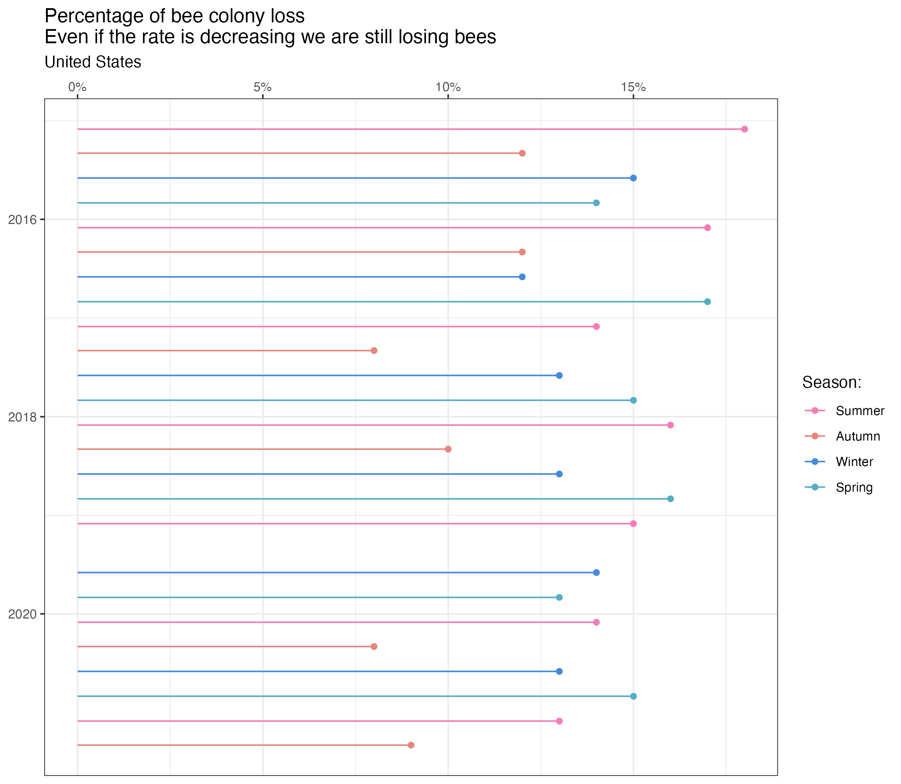
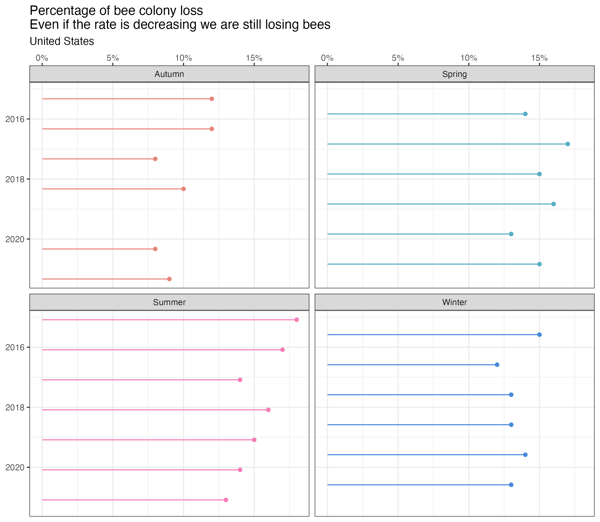

# TidyTuesday 2022 week 2 - Bees

<!-- badges: start -->
<!-- badges: end -->

This is my contribution to this TidyTuesday.

This TidyTuesday is about decrease of bees colonies in US.

In the beginning I got real confused with the colony dataset, couldn't figure out how the percent values were calculated.

Initially I though about a lolliplot with the segment showing the start and end point in the number of colonies each period. But with colonies been added and renewed many numbers get withou variation between periods (that's why the lost number and the lost percentual are confusing).

Anyway, to make the plot a little different I used this starkoverflow instruction on how to invert a Date axis in ggplot:

[https://stackoverflow.com/questions/43625341/reverse-datetime-posixct-data-axis-in-ggplot](https://stackoverflow.com/questions/43625341/reverse-datetime-posixct-data-axis-in-ggplot)

I had to update the suggested function as it seems that instead of "trans" function it changed to "transform".

It seems to me that it would be more intuitive if time was presented in a top-down perspective (just like in a schedule graph).

And even if the loss rate is smaller for some more recent periods (not for all states), it still means that the number of colonies is decreasing, which is very scary.

Hey TidyTuesday, wouldn't it be possible to have some "happy" data at least in the beginning of the year?

Hoppe you like my plot!

A lolliplot graph with the y axis inverted.

A facet graph is also interesting:

